

**Desarrollo Colaborativo Git y GitHub**

Laura Catalina Castiblanco Gómez y Edward Nicolas Ramírez Rocha

Ingeniería de Sistemas, Universidad de Cundinamarca

Línea de Profundización III

Alejandro Sastoque

31 de agosto de 2025

# **Herramientas usadas**

## **Git**
Es un sistema de control de versiones distribuido fue creado por Linus Torvalds en 2005 esta permite llevar un historial completo de cambios de archivos y colaborar sin que dependa de una conexión central (Git, 2025).
## **GitHub** 
Es una plataforma en la nube que permite almacenar, compartir y colaborar en proyectos de software mediante Git. Tiene funciones como gestión de repositorios, seguimiento de issues, pull requests, revisiones de código, integración continua, entornos de desarrollo en la nube (Codespaces) y más (GitHub, 2025).
## **Almalinux**
Es una distribución Linux de código abierto, gratuita y orientada a entornos empresariales, creada por la comunidad. Es totalmente compatible a nivel binario con Red Hat Enterprise Linux (RHEL), y surge como alternativa estable tras el cambio de enfoque de CentOS (Almalinux, 2025).
## **Cursor IA**
Es un entorno de desarrollo integrado (IDE) potenciado por inteligencia artificial, desarrollado por Anysphere Inc. Basado en Visual Studio Code, añade funciones como generación y reescritura de código mediante lenguaje natural, autocompletado inteligente, comprensión de la base de código, y soporte para extensiones (Cursor, 2025).
# **Procedimiento**
**Figura 1** 

*Almalinux*

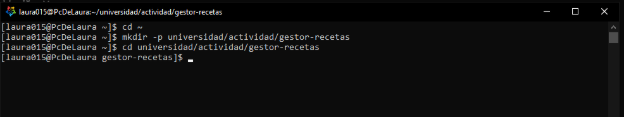

Nota: Creación del directorio en almalinux, teniendo la ruta *universidad/actividad/gestor-recetas*, a su vez ingresamos en la carpeta.

**Figura 2**	

*Cursor IA*

Nota: Se ingresa a cursor IA, en la esquina inferior izquierda aparecerá esta opción la cual nos permite conectar el Almalinux.

`	`**Figura 3**
**\
`		`*Conexión WSL*

Nota: Después de hacer clip en la opción anterior, aparecerá la opción de conectar mediante WSL, damos clip en este botón.

`	`**Figura 4**
**\
`		`*Abrir folder*

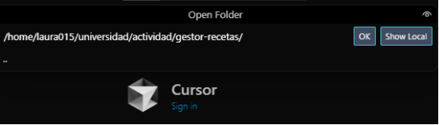

Nota: Abrir la ruta del proyecto cuando se le da a la opción de open Project.

`	`**Figura 5**
**\
`		`*Proyecto*

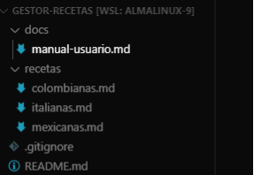

Nota: Se crea la estructura del proyecto, teniendo en cuenta las instrucciones en relación al nombre de las carpetas y los archivos.

`	`**Figura 6**	

*GitHub*

Nota: Crear el repositorio en GitHub con el nombre *gestor-recetas* y le damos clip a la opción crear repositorio.

`	`**Figura 7**
**\
`		`*Iniciar repositorio*

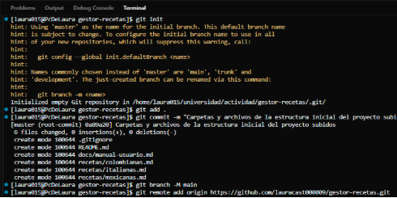

Nota: Se inicializa el repositorio, se suben los archivos mediante la rama main y se conecta con el repositorio remoto.

`	`**Figura 8**
**\
`		`*Subir los cambios*

Nota: Se suben los cambios al repositorio de GitHub.

`	`**Figura 9**
**\
`		`*Crear ramas*

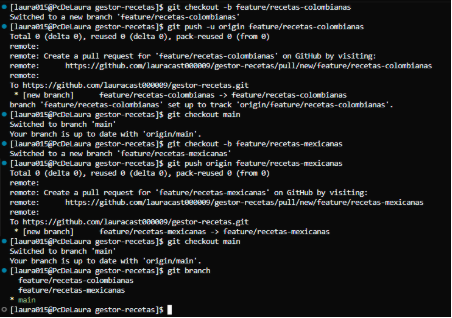

Nota: Creación de 2 ramas para el proyecto y subirlas a GitHub por medio del comando *git push origin.*

**Figura 10**
**\
`		`*Commits*

Nota: Se realizan 3 commits en la rama recetas-colombianas

**Figura 11**
**\
`		`*Commits*

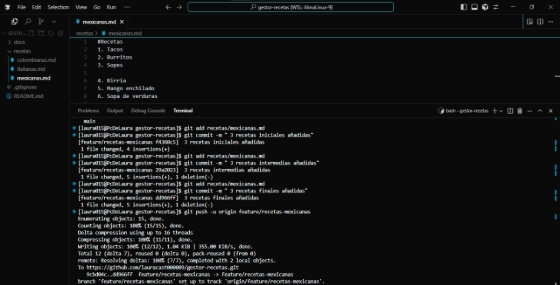

Nota: Se realizan 3 commits desde la rama recetas-mexicanas.

**Figura 12**
**\
`		`*Verificación*

Nota: Se verifica que los cambios hechos en las 2 ramas ya se hayan subido al repositorio de GitHub, además tendremos la opción de realizar un *pull request.*

***Figura 13***
**\
`		`*Pull Request RC*

Nota: Realizar el pull request de la rama receta-colombianas agregando un título, además se invita al colaborador para realizar la revisión del proceso.

***Figura 14***
**\
`		`*Review*

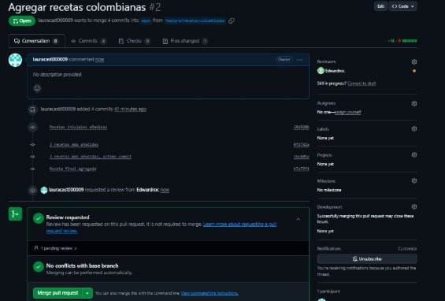

Nota: Si los cambios que se quieren fusionar con la rama main no presentan ningún conflicto nos habilitara la opción merge.

***Figura 15***
**\
`		`*Merge Pull request*

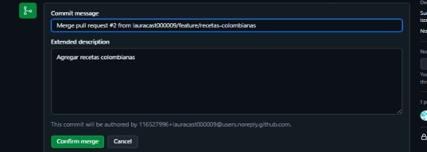

Nota: Se da clip a la opción merge, luego daremos título a este proceso o dejamos el que GitHub nos da por defecto y eliminamos la rama.

***Figura 16***
**\
`		`*Revisor*

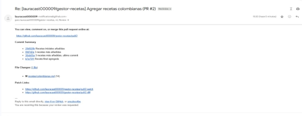

Nota: Al colaborador le llegara este correo donde se le invita a revisar el pull request hecho por la otra persona.

***Figura 17***
**\
`		`*Revisando*

Nota: Al dar clip en el enlace que llega al correo, nos dirigirá al pull request hecho por la otra persona, en la cual se puede dejar un comentario sobre lo hecho, además nos da la opción de revertir algún cambio hecho.

***Figura 18***
**\
`		`*Commits RM*

Nota: Se realizan 3 commits desde la rama recetas-mexicanas y se suben los cambios al repositorio GitHub.

***Figura 19***
**\
`		`*Pull Request RM*

Nota: Realizar el pull request de la rama receta-mexicanas agregando un título, además se invita al colaborador para realizar la revisión del proceso.

***Figura 20***
**\
`		`*Merge Pull request*

Nota: Se da clip a la opción merge, luego daremos título a este proceso o dejamos el que GitHub nos da por defecto y eliminamos la rama.

***Figura 21***
**\
`		`*Comentario*

Nota: En la revisión del compañero a este pull request, se redactó un comentario sobre el trabajo realizado.

**Figura 22**
**\
`		`*Invitación*

Nota: Se realiza la invitación de colaborador a el compañero de proyecto en GitHub.

**Figura 23**
**\
`		`*Clonación*

Nota: El compañero copia el link del repositorio en modo colaborador y lo clona mediante la terminal.

**Figura 24**
**\
`		`*Visualización*

Nota: Se evidencia el repositorio clonado y mediante un *git log* vemos el commit hecho por el creador del proyecto.

**Figura 25**
**\
`		`*Crear rama RI*

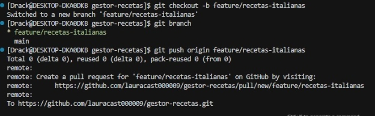

Nota: Se realiza la creación de la rama recta-italianas y se sube al repositorio.

**Figura 26**
**\
`		`*Commits RI*

Nota: Se realizan 3 commits en la rama recetas-italianas.

**Figura 27**
**\
`		`*Cambios*

Nota: Se suben los cambios hechos desde esta rama a GitHub.

**Figura 28**
**\
`		`*Verificar*

Nota: Se verifica que se hayan subido los cambios desde la rama receta-italianas y se da a la opción pull request.

**Figura 29**
**\
`		`*Pull Request RI*

Nota: Se realiza el proceso pull request desde la rama recetas-italianas agregando un título y a la compañera que revisara el proceso.

**Figura 30**
**\
`		`*Merge* 

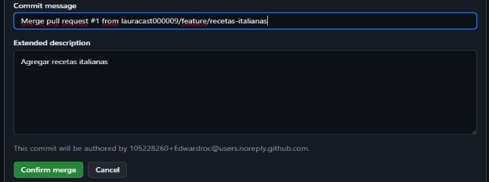

Nota: Se da en la opción merge pull request y se deja el titulo por defecto, este proceso lo que hace es fusionar los cambios hechos desde esta rama a la rama main.

**Figura 31**
**\
`		`*Eliminación*

Nota: Se elimina la rama recetas-italianas, porque ya no es necesario en el proyecto.

**Figura 32**
**\
`		`*Revisor*

Nota: Al correo de la compañera llegara este correo, el cual la invita a revisar el pull request que se hizo anteriormente, esto dando clip al enlace.

**Figura 33**
**\
`		`*Review pull request RI*

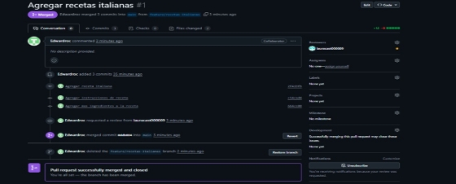

Nota: La compañera que será revisora tendrá acceso a revertir los cambios hechos y también a dejar un comentario es dicho proceso.

**Figura 34**
**\
`		`*Rama Conflicto A*

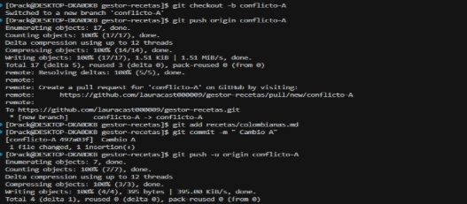

Nota: Creación de una rama llamada conflicto A, en la cual editaremos en documento de recetas-colombianas y subiremos los cambios a GitHub.

**Figura 35**
**\
`		`*Pull request C-A*

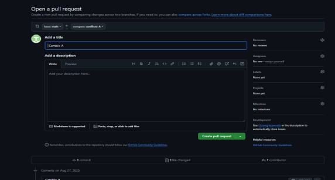

Nota: Se intenta realizar un pull request para los cambios realizados en la rama conflicto A.

**Figura 36**
**\
`		`*Conflicto*

Nota: Al momento de realizar el merge de este proceso no nos dará la opción válida, ya que hay un conflicto con los cambios hechos anteriormente en el documento recetas-colombianas.

**Figura 37**
**\
`		`*Resolver conflicto*

Nota: Para resolver el conflicto lo haremos desde la terminal del proyecto, usando los comandos *git fetch origin* y *git merge origin/main*, los cuales traerán los 2 cambios que están en conflicto y se visualizaran en la parte superior de la pantalla distinguidos por un color diferente, aquí lo que se debe realizar es editar el archivo dejando la versión que deseamos.

**Figura 38**
**\
`		`*Commit conflicto resuelto*

Nota: Se realiza un Commit sobre la solución del conflicto y subimos el cambio al repositorio.

**Figura 39**
**\
`		`*Pull request C-A*

Nota: Se realiza el pull request ya con el conflicto solucionado, en el cual ya veremos la opción merge en verde, lo cual significa que ya no hay ningún conflicto que nos impida realizar la fusión de las ramas.

**Figura 40**
**\
`		`*Crear ramas*

Nota: Se elimina la rama que ya no necesitamos.

**Figura 41**
**\
`		`*Ignorar*

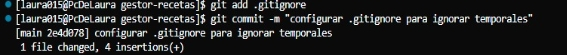

Nota: Creamos un archivo .*gitignore*, el cual sirve para no subir los archivos o documentos que no deseemos al repositorio, en este caso los archivos temporales, se realiza el Commit debido y se suben los cambios desde la rama main.

**Figura 42**
**\
`		`*Tag*

Nota: Creamos un tag con la versión que estamos realizando, en este caso la versión 1.0.0 y le asignamos el nombre Gestor de recetas, lo subimos desde la rama main al repositorio.

**Figura 43**
**\
`		`*Tag v1.0.0*

Nota: Revisamos en GitHub este cambio y efectivamente podemos ver el cambio guardado.

**Figura 44**
**\
`		`*Proyecto* 

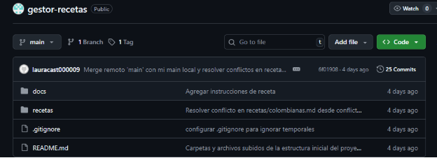

Nota: Nos dirigimos a GitHub y veremos el proyecto con todos los cambios en la rama main, siendo esta la única que existe, además podemos ver que existe un tag y que se realizaron un total de 25 commits en el proyecto.

Link video:  <https://youtu.be/4WaqEtsVchM> 

Enlace repositorio:  <https://github.com/lauracast000009/gestor-recetas.git> 

**Referencias bibliográficas**

Chacon, S., & Straub, B. (s.f.). *Pro Git Book: About Version Control*. Obtenido de git-scm.com. [git-scm.com](https://git-scm.com/book/ms/v2/Getting-Started-About-Version-Control?utm_source=chatgpt.com)

Git (2025). *Wikipedia*. Obtenido de Wikipedia. [Wikipedia](https://en.wikipedia.org/wiki/Git?utm_source=chatgpt.com)

GitHub (2025). *Wikipedia*. Obtenido de Wikipedia. [Wikipedia](https://en.wikipedia.org/wiki/GitHub?utm_source=chatgpt.com)

AlmaLinux OS (s.f.). Obtenido de almalinux.org. [AlmaLinux OS](https://almalinux.org/?utm_source=chatgpt.com)

Cursor (2025). *Wikipedia*. Obtenido de Wikipedia. [Wikipedia](https://en.wikipedia.org/wiki/Cursor_%28code_editor%29?utm_source=chatgpt.com)

